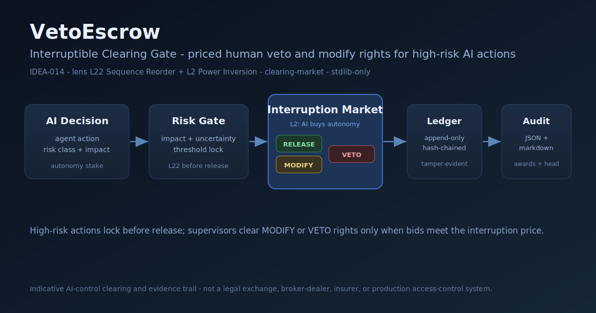

# VetoEscrow



VetoEscrow is an interruptible clearing gate for high-risk AI decisions.

It turns an AI decision into an escrowed autonomy claim:

1. score the decision risk,
2. lock decisions above the gate threshold,
3. price the human interruption right,
4. clear supervisor `modify` or `veto` bids,
5. write the outcome into a tamper-evident ledger.

This is a local, deterministic Python MVP. It is not a production access-control
system, legal exchange, broker-dealer, insurer, or settlement venue.

## Install

```bash
python -m pip install -e .
```

## Quick Start

```bash
python -m vetoescrow sample -o examples/decision_batch.json
python -m vetoescrow run -i examples/decision_batch.json --full -o examples/clearing_report.json
python -m vetoescrow run -i examples/decision_batch.json --markdown -o examples/clearing_report.md
python -m vetoescrow verify-ledger -i examples/clearing_report.json
```

## Why It Exists

Binary human approval does not scale. Passive observability does not interrupt.
VetoEscrow makes intervention explicit and scarce: high-risk AI decisions must
carry an autonomy stake, and humans can clear priced rights to modify or veto.

## Output

- `released`: risk below threshold, no escrow.
- `held_unclaimed`: high-risk decision locked, but no bid met the price.
- `modify_right_sold`: human supervisor bought a modify right.
- `veto_right_sold`: human supervisor bought a veto right.

## Development

```bash
python -m pytest -q
```

Runtime dependencies: none beyond the Python standard library.
